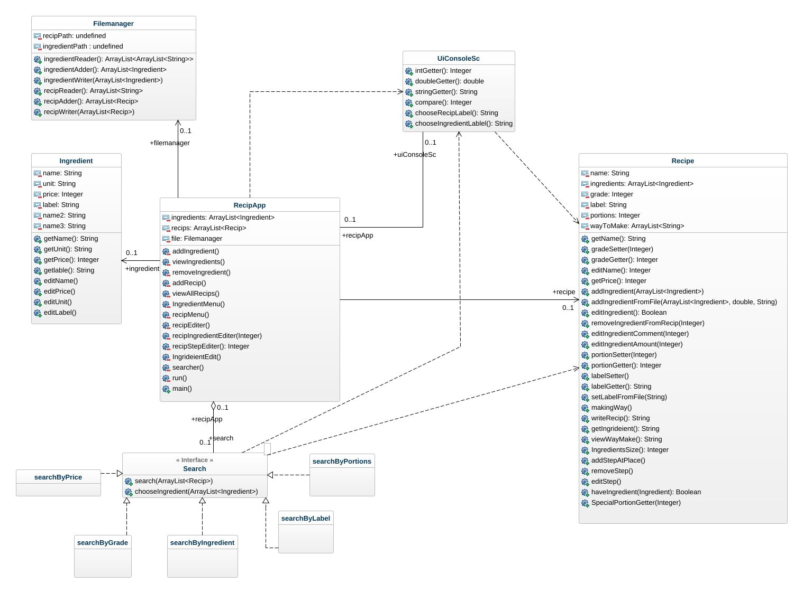

## Class diagram

I know for sure that is not the correct way to design or introduce the class diagram even that the dependencies, associations and the connection between classes is not that much of correct but as far as I understande it so this is the best design I can come up with.